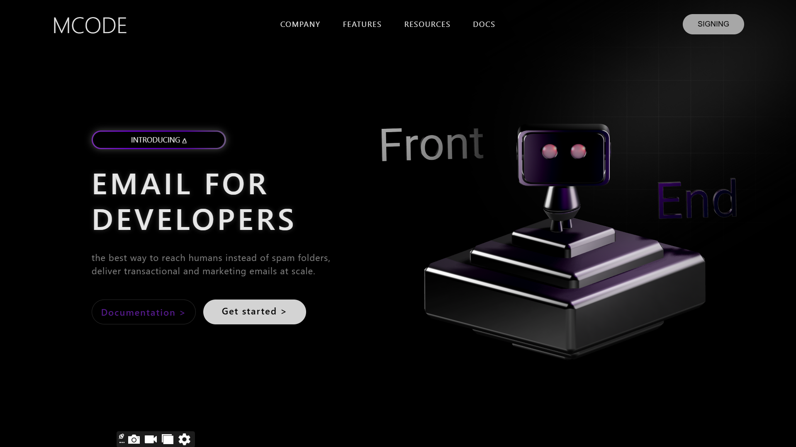

# 📧 MCODE – Email for Developers

MCODE is a beautiful landing page introducing a modern email solution designed for developers. It showcases a stylish UI, scroll animations, and 3D visuals to engage users while promoting email delivery services.



---

## 🌟 Features

- 🔄 Smooth animations using AOS (Animate On Scroll)
- 🤖 Interactive 3D Robot using Spline
- 🎨 Gradient background with blur effect
- 📱 Responsive layout for all devices
- 📘 Buttons for quick access to docs and signup

---

## 🚀 Technologies Used

- **HTML5** – Markup
- **CSS3** – Styling and layout
- **AOS.js** – Animate elements on scroll
- **Spline Viewer** – 3D model embedding
- **Google Fonts** – Beautiful typography

---

## 📂 Project Structure

```
MCODE/
│
├── index.html           # Main HTML file
├── style.css            # Custom CSS styles
├── gradient.png         # Background gradient image
├── screenshot.png       # Screenshot of the UI
```

---

## 🛠️ Getting Started

To view this project locally:

1. **Clone the repository:**
   ```bash
   git clone https://github.com/your-username/mcode.git
   ```

2. **Navigate to the project folder:**
   ```bash
   cd mcode
   ```

3. **Open `index.html` in your browser.**

That’s it! No need to install any dependencies.

---

## 📸 Screenshots

Here's a preview of the project UI:


> Make sure the `screenshot.png` file is placed in the root of your project.

---

## 🔮 Upcoming Features

- 🌙 Dark mode toggle
- 📩 Email API integration (e.g., Mailgun, SendGrid)
- ✨ Enhanced animations with scroll direction detection

---

## 📄 License

This project is licensed under the [MIT License](LICENSE).

---

## 🙌 Special Thanks

- [AOS - Animate On Scroll](https://michalsnik.github.io/aos/)
- [Spline 3D Viewer](https://spline.design)
